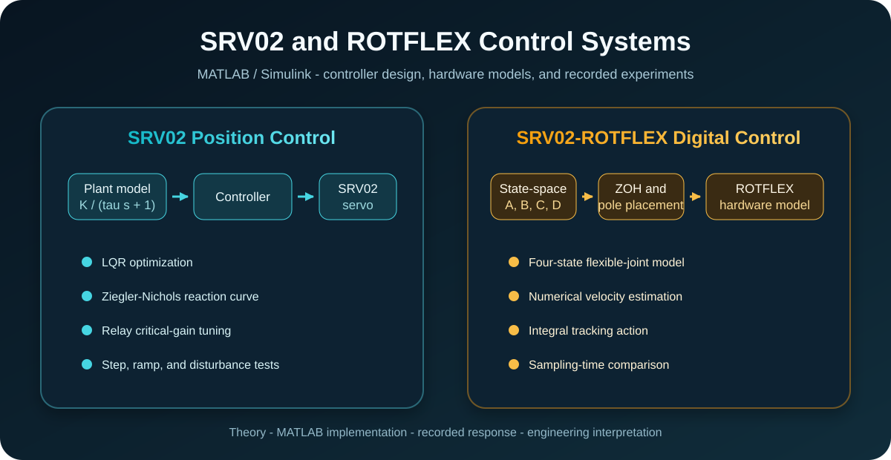
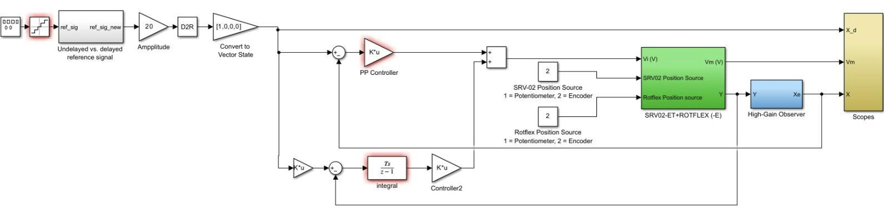
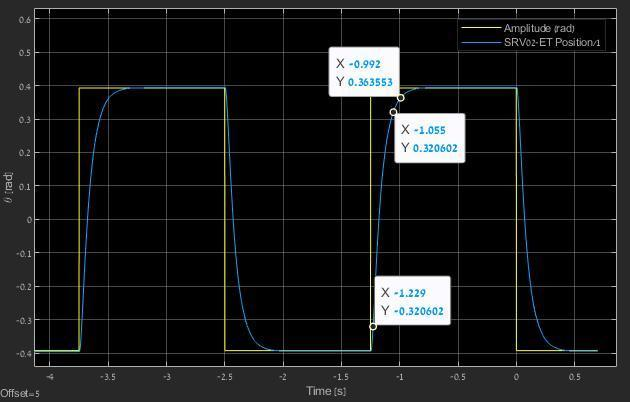
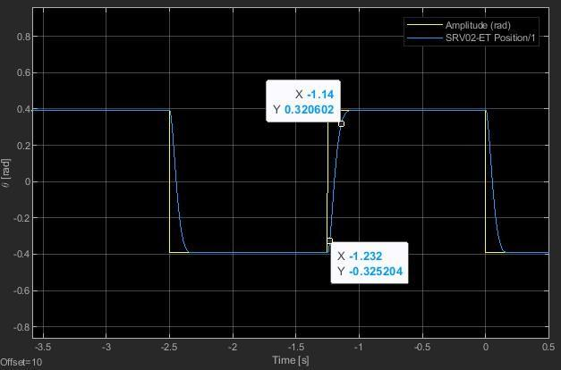
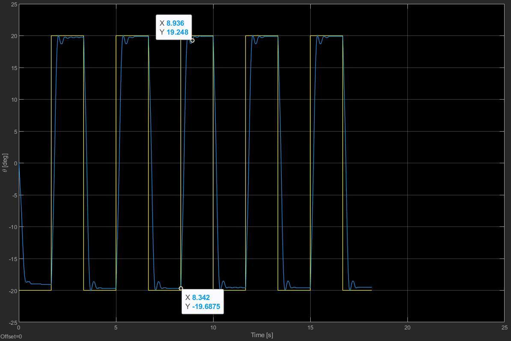
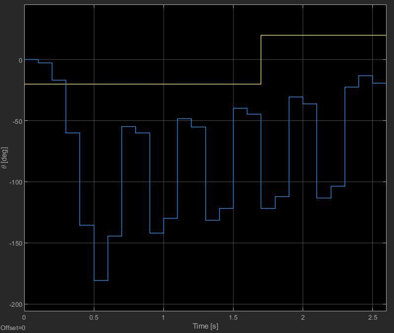

# SRV02 and ROTFLEX Control Systems

<p align="center">
  
  
  
  <a href="LICENSE"></a>
</p>

<p align="center">
  
</p>

MATLAB and Simulink implementations for position control of the Quanser SRV02
rotary servo and discrete control of the SRV02-ROTFLEX flexible joint. The
repository connects control theory to controller design, Simulink models, and
recorded experimental behavior.

The project covers LQR design, Ziegler-Nichols reaction-curve tuning, relay
auto-tuning, discrete pole placement, integral action, numerical state
estimation, and the effect of sampling time on closed-loop performance.

<p align="center">
  <strong><a href="notebooks/srv02-rotflex-control.ipynb">Open the technical notebook: theory → MATLAB → result → interpretation</a></strong>
</p>

## Contents

- [Project at a glance](#project-at-a-glance)
- [System overview](#system-overview)
- [Results and evidence](#results-and-evidence)
- [Reproducibility](#reproducibility)
- [Hardware and software](#hardware-and-software)
- [Quick start](#quick-start)
- [Repository structure](#repository-structure)
- [Known limitations](#known-limitations)
- [License](#license)

## Project at a glance

- Three position-controller tuning workflows applied to the SRV02 plant.
- A four-state physical model of the SRV02-ROTFLEX mechanism.
- Zero-order-hold discretization and direct digital pole placement.
- Numerical angular-velocity estimation from measured positions.
- Recorded step, ramp, disturbance, control-voltage, and sampling-time results.
- QUARC-ready Simulink models for Q2-USB hardware interfacing.
- A detailed [technical notebook](notebooks/srv02-rotflex-control.ipynb) that
  follows a theory - code - visual result - interpretation sequence.

## System overview

The repository contains two related control studies.

### 1. SRV02 position control

The load-speed model is approximated by

$$
\frac{\Omega_l(s)}{V_m(s)}=\frac{K}{\tau s+1},
$$

and the corresponding position model includes an additional integrator. Three
controller-design approaches are compared:

- Linear Quadratic Regulator (LQR).
- Ziegler-Nichols tuning from the step-response tangent.
- Relay auto-tuning from the critical gain and period.

### 2. SRV02-ROTFLEX digital control

The flexible-joint state is

$$
x^T=\begin{bmatrix}\theta & \alpha & \dot{\theta} & \dot{\alpha}\end{bmatrix},
$$

where $\theta$ is the SRV02 load angle and $\alpha$ is the flexible-joint
deflection. The continuous model is discretized with a zero-order hold, the
controller is designed by pole placement, and the unmeasured angular
velocities are estimated numerically.

<p align="center">
  
</p>

The block labeled `High-Gain Observer` in the stored model is a legacy name.
In `Q_MDL_DISC.mdl`, its active path uses discrete numerical derivatives; in
`Q_CONTROL_Discret.mdl`, filtered derivatives are used.

## Results and evidence

The figures below are recorded experiment or model-run captures retained from
the project. They are not regenerated synthetic data.

| LQR step response | Tuned Ziegler-Nichols step response |
|:--:|:--:|
|  |  |

| Digital control at 2 ms | Loss of control at 100 ms |
|:--:|:--:|
|  |  |

### Summary

| Study | Recorded outcome |
|---|---|
| LQR position control | 0.174 s rise time, approximately 0.758 s settling time, and low control effort |
| Tuned Ziegler-Nichols | 0.092 s rise time after iterative adjustment to avoid saturation |
| Tuned relay controller | 0.072 s rise time and 1.125% overshoot, with less voltage margin |
| Digital control, $T_s=0.002$ s | Stable response comparable to the continuous controller |
| Digital control, $T_s=0.05$ s | Stable but slower and more oscillatory |
| Digital control, $T_s=0.1$ s | Recorded loss of control |

See the [technical notebook](notebooks/srv02-rotflex-control.ipynb) for the
equations, controller parameters, complete result sequence, and engineering
interpretation.

### Evidence classification

| Material | Classification | Reproducibility from this repository |
|---|---|---|
| Position-control figures 09-34 | Recorded controller-evaluation captures retained from the project | The figures and reported metrics are preserved; raw time-series logs are unavailable |
| Flexible-joint figures 35-42 | Recorded continuous/discrete comparison captures | The original metadata does not fully distinguish every model run from every hardware capture |
| `sampling_time_comparison.m` | Supplemental offline simulation | Reproducible with MATLAB and Control System Toolbox; not presented as recorded evidence |
| `observer_estimator_comparison.m` | Supplemental synthetic-noise simulation | Reproducible with MATLAB and explicitly separated from experimental results |

## Reproducibility

| Workflow | Hardware required | Main requirements | Expected output |
|---|:--:|---|---|
| View README and notebook | No | GitHub or a Jupyter-compatible viewer | Rendered equations, code, diagrams, and recorded results |
| LQR design | No | MATLAB, Control System Toolbox | LQR gain and closed-loop poles |
| Ziegler-Nichols analysis | No | MATLAB, Control System Toolbox | Maximum-slope tangent and PID starting values; recorded vectors are required for experimental retuning |
| Relay auto-tuning | No | MATLAB, Simulink, Signal Processing Toolbox | Relay oscillation metrics, critical gain/period, and PID starting values |
| Flexible-joint pole placement | No | MATLAB, Simulink, Control System Toolbox | Continuous/discrete matrices, mapped poles, and feedback gain |
| Offline sampling/estimator comparisons | No | MATLAB and the listed toolboxes | Comparison plots, control effort, settling time, and estimator-error metrics |
| QUARC hardware execution | Yes | Compatible MATLAB/QUARC release and Quanser hardware | Supervised real-time acquisition and actuation |

## Hardware and software

### Core software

- MATLAB R2021a or a release compatible with the installed QUARC version.
- Simulink.
- Control System Toolbox.
- Signal Processing Toolbox for `findpeaks` in the relay-tuning script.

### Hardware workflow

- Quanser SRV02 rotary servo.
- Quanser ROTFLEX or ROTFLEX-E flexible-joint module.
- Quanser Q2-USB data-acquisition device.
- VoltPAQ or a compatible UPM amplifier, according to the selected setup.
- Quanser QUARC Targets and the associated Simulink libraries.

The hardware models were saved with analog output disabled. Follow the
[hardware preparation checklist](#4-prepare-for-hardware-execution) before
enabling any real-time output.

## Quick start

Clone the repository and start MATLAB from its root:

```bash
git clone https://github.com/yuvalMARMOR/control-systems-srv02-rotflex.git
cd control-systems-srv02-rotflex
```

The notebook can be read directly on GitHub without MATLAB. MATLAB is required
only for recomputing designs or running the supplemental simulations.

### 1. Recompute the position-control designs

```matlab
cd('SRV02-Position-Control')
run('LQR_Controller.m')   % Prints the LQR gain and closed-loop poles.
run('Q2_ZN.m')            % Draws the reaction-curve tangent and prints tuning values.
run('Q2_RELAY.m')         % Simulates relay tuning and prints Kc, Tc, and PID values.
```

`Q2_ZN.m` can use recorded `theta_l` and `t` vectors when they are available.
Without them it runs a model-based illustration and reports that the output is
not a reconstruction of the recorded experiment. `Q2_RELAY.m` requires the
included `RELAY_TUNING.slx` model and `findpeaks`.

### 2. Recompute the flexible-joint controller

```matlab
cd('SRV02-Observer-Control')
run('model3.m')
open_system('Q_MDL_DISC')
```

`model3.m` adds the module path, initializes the SRV02-ROTFLEX configuration,
forms the continuous and discrete state-space models, and computes the nominal
2 ms pole-placement gain. Expected console output includes the mapped discrete
poles, the gain matrix `K`, and the integral gain `KI`.

### 3. Run the supplemental offline comparisons

```matlab
run('sampling_time_comparison.m')
run('observer_estimator_comparison.m')
```

The first script compares the fixed nominal gain at 2 ms, 50 ms, and 100 ms.
The second compares numerical differentiation, a Luenberger observer, and a
Kalman filter under reproducible synthetic noise. Both generate plots and
print quantitative metrics; neither recreates the recorded experiment.

### 4. Prepare for hardware execution

Open the selected `.mdl` hardware model only after the offline calculations
are correct. Confirm the Q2-USB channels, sensor direction, amplifier setting,
mechanical travel, emergency stop, and the configured voltage limit before
enabling analog output. Hardware operation must remain directly supervised.

## Repository structure

```text
.
|-- assets/
|   |-- diagrams/                      # Architecture and Simulink diagrams
|   `-- results/                       # Recorded experiment/model-run figures
|-- notebooks/
|   `-- srv02-rotflex-control.ipynb    # Main technical walkthrough
|-- SRV02-Position-Control/
|   |-- LQR_Controller.m
|   |-- Q2_RELAY.m
|   |-- Q2_ZN.m
|   `-- RELAY_TUNING.slx
|-- SRV02-Observer-Control/
|   |-- model3.m
|   |-- sampling_time_comparison.m
|   |-- observer_estimator_comparison.m
|   |-- Q_CONTROL_Discret.mdl
|   |-- Q_MDL_DISC.mdl
|   `-- Modules/                       # Quanser setup and plant support files
|-- LICENSE
`-- THIRD_PARTY_NOTICES.md
```

## Known limitations

- Raw experiment logs are not available; recorded figures and reported
  numerical metrics are preserved as evidence, but cannot all be recomputed.
- The hardware-linked models require the matching QUARC installation and may
  show unresolved library links on systems without Quanser software.
- The two `.mdl` controller variants contain different derivative filtering
  and integral gains; `Q_MDL_DISC.mdl` is the model aligned with the nominal
  numerical-derivative design presented in the notebook.
- MATLAB and QUARC execution is not currently covered by automated CI.
- The supplemental estimator-comparison script uses explicitly labeled
  synthetic measurement noise and is not an experimental result.

## License

Original project material is released under the [MIT License](LICENSE).
Quanser support files and QUARC-linked material retain their existing notices;
see [Third-Party Notices](THIRD_PARTY_NOTICES.md).
